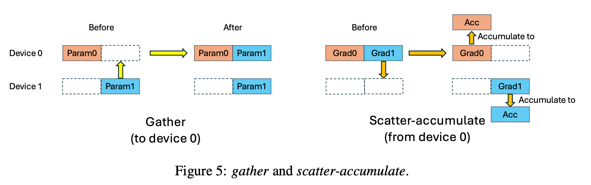

# On-demand Communication (ODC)

ODC is a high-performance communication library that adapts Parameter Server (PS) into Fully Sharded Data Parallel (FSDP) by replacing collective all-gather and
reduce-scatter with on-demand point-to-point communication.


With ODC, the synchronization frequency is reduced from per-iteration to per-minibatch, which fundamentally reduces the workload-imbalance bubbles in FSDP.

ODC is accepted in ICLR 2026! Check out the [paper](https://openreview.net/pdf?id=iIEEgI6WsF) for more details.

## ODC Primitives

The key idea is to replace the collective all-gather and reduce-scatter with a on-demand point-to-point communication.



TO support transparent on-demand communications, we implement RDMA based primitives based on cuda IPC (intra-node) and NVSHMEM (inter-node). Details are in [odc/primitives](./odc/primitives).

## Support for FSDP
- FSDP1
- FSDP2
  - HSDP (`reshard_after_forward=int` not supported)

## Usage

### Prerequisites

- PyTorch (with CUDA support)
- CUDA 12.x
- Python >= 3.8

We highly recommand using a pytorch container like
- `nvcr.io/nvidia/pytorch:25.06-py3` [Full List](https://catalog.ngc.nvidia.com/orgs/nvidia/containers/pytorch/tags)
- `pytorch/pytorch:2.9.0-cuda12.8-cudnn9-devel` [Full List](https://hub.docker.com/r/pytorch/pytorch/tags)

### Install ODC
```
pip install --no-build-isolation -e .
```
It **requires some time** to compile the CUDA extension `tensor_ipc`.

## Quick Start

A complete example is provided in `examples/llm_training/`:
```shell
pip install -r examples/llm_training/requirements.txt

bash examples/llm_training/run.sh
```

## Memory
> User may need to tune `NVSHMEM_SYMMETRIC_SIZE` for better memory usage.
In ODC, NVSHMEM symmetric buffer are only allocated for sharded parameters.
To achieve smallest memory footprint,
`NVSHMEM_SYMMETRIC_SIZE` should be set to be slightly higher than the size of sharded parameters.

### Basic Usage with FSDP1

```python
import torch
from torch.distributed.fsdp import FullyShardedDataParallel as FSDP

import odc
from odc.fsdp import fsdp1


fsdp1.patch_fsdp1()

torch.distributed.init_process_group(backend="nccl", device_id=device)
odc.init_nvshmem()


fsdp_model = FSDP(
    model,
    # ...
)

for epoch in range(10):
    fsdp1.pre_minibatch_start(fsdp_model)
    for minibatch in dataset:
        loss = loss_fn(model)
        fsdp1.pre_optimizer_step(model)
        optimizer.step()
        optimizer.zero_grad()

fsdp1.stop()
```

### Basic Usage with FSDP2

```python
import torch
import odc
from odc.fsdp import fsdp2


torch.distributed.init_process_group(backend="nccl", device_id=device)
odc.init_nvshmem()

fsdp2.patch_fsdp2()

for layer in model.layers:
    fully_shard(layer, **fsdp_kwargs)
fsdp_model = fully_shard(model, **fsdp_kwargs)

# Call patch_lazy_init just as how we call fully_shard above.
for layer in fsdp_model.layers:
    fsdp2.patch_lazy_init(layer)
fsdp2.patch_lazy_init(fsdp_model)

for epoch in range(10):
    fsdp2.pre_minibatch_start(fsdp_model)
    for minibatch in dataset:
        loss = loss_fn(model)
        fsdp2.pre_optimizer_step(model)
        optimizer.step()
        optimizer.zero_grad()

fsdp2.stop()
```


## Development

### Running Linter
```
make lint
```

### Running Tests
```bash
make test
```
